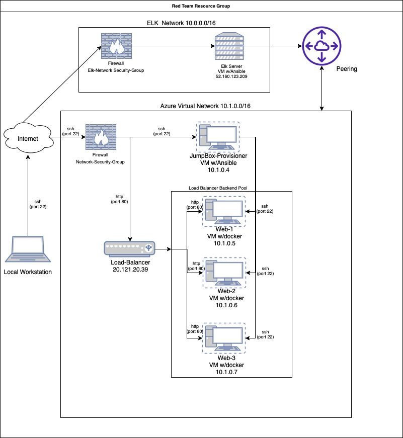
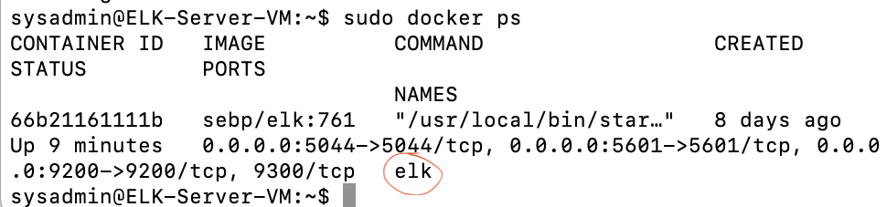

## Automated ELK Stack Deployment

The files in this repository were used to configure the network depicted below.

These files have been tested and used to generate a live ELK deployment on Azure. They can be used to either recreate the entire deployment pictured above. Alternatively, select portions of the yml and config file may be used to install only certain pieces of it, such as Filebeat.

  [Ansible Configuration - ansible.cfg](Ansible/ansible.cfg)

  [My Playbook - playbook.yml](Ansible/playbook.yml)

  [Filebeat Playbook - filebeat-playbook.yml](Ansible/filebeat-playbook.yml)

  [Filebeat Configuration - filebeat-config.yml](Ansible/files/filebeat-config.yml)

  [Metricbeat Playbook - metricbeat-playbook.yml](Ansible/metricbeat-playbook.yml)

  [Metricbeat Configuration - metricbeat-config.yml](Ansible/files/metricbeat-config.yml)

  [Elk - elk.yml](Ansible/elk.yml)

 [Hosts ](Ansible/hosts)

This document contains the following details:
- Description of the Topology
- Access Policies
- ELK Configuration
  - Beats in Use
  - Machines Being Monitored
- How to Use the Ansible Build

### Description of the Topology

The main purpose of this network is to expose a load-balanced and monitored instance of DVWA, the D*mn Vulnerable Web Application.

Load balancing ensures that the application will be highly available, in addition to restricting access to the network.

- The load balancer helps to protect availability of the network by evenly distributing traffic so one server is not overwhelmed thereby mitigating DoS Attack.

- The Jump Box Provisioner is used in Infrastruture as a Code (IaC) setups to automate configuration changes to computers and limit access to the virtual network.

Integrating an ELK server allows users to easily monitor the vulnerable VMs for changes to the data and system logs.

- Filebeat monitors the log files or locations that you specify, collects log events and forwards them either to the Elasticsearch or Logstash for indexing.

- Metricbeat helps you monitor your servers by collecting metrics from the systema nd services running on the servers such as Apache, MySQL, HAProxy, Mongo DB etc.

The configuration details of each machine may be found below.
_Note: Use the [Markdown Table Generator](http://www.tablesgenerator.com/markdown_tables) to add/remove values from the table_.

| Name                | Function              | IP Address | Operating System |
|---------------------|-----------------------|------------|------------------|
| JumpBox-Provisioner | Gateway               | 10.1.0.4   | Linux            |
| Web-1               | Host DVWA 1           | 10.1.0.5   | Linux            |
| Web-2               | Host DVWA 2           | 10.1.0.6   | Linux            |
| Web-3               | Host DVWA             | 10.1.0.7   | Linux            |
| ELK                 | Metric/Log Collection | 10.0.0.4   | Linux            |

### Access Policies

The machines on the internal network are not exposed to the public Internet. 

Only the Jumpbox machine can accept connections from the Internet. Access to this machine is only allowed from the following IP addresses:
- My Workstation using my Public IP via SSH port 22.

Machines within the network can only be accessed by 10.0.4 (ELK Server).

- Which machine did you allow to access your ELK VM? 
My Public IP address via TCP port 5601.

A summary of the access policies in place can be found in the table below.

| Name     | Publicly Accessible | Allowed IP Addresses                        |
|----------|---------------------|---------------------------------------------|
| Jump Box | No                  | My Workstaion Public IP via SSH on Port 22  |
| Web 1    | No                  | 10.1.0.5 via SSH on Port 22                 |
| Web 2    | No                  | 10.1.0.6  via SSH on Port 22                |
| Web 3    | No                  | 10.1.0.7  via SSH on Port 22                |
| ELK      | Yes                 | My Workstaion Public IP via HHTP on Port 80 |

### Elk Configuration

Ansible was used to automate configuration of the ELK machine. No configuration was performed manually, which is advantageous because...
- What is the main advantage of automating configuration with Ansible?
It is flexible and makes it easy to resuse changes on the other associtaed VMs.

The playbook implements the following tasks:
- Install Docker
- Install Python3-pip 
- Increase and Use the Virtual Memory
- Install and Launch Docker Elk Container
- Enable docker on boot

The following screenshot displays the result of running `docker ps` after successfully configuring the ELK instance.

 

### Target Machines & Beats
This ELK server is configured to monitor the following machines:
- Web-1 : 10.1.0.5
- Web-2 : 10.1.0.6
- Web-3 : 10.1.0.7

We have installed the following Beats on these machines:
- Filebeat
- Metricbeat

These Beats allow us to collect the following information from each machine:
- Filebeat monitors data logs such as Unique vistors, operating systems, heatmap etc.
- Metricbeats collects metrics and system statistics such as CPU usage, RAM etc.

### Using the Playbook
In order to use the playbook, you will need to have an Ansible control node already configured. Assuming you have such a control node provisioned: 

SSH into the control node and follow the steps below:
- Copy the [ansible.cfg](Ansible/ansible.cfg) file to /etc/ansible.
- Update the /etc/ansible/hosts file to include the virtual elk server as seen below.

- Run the playbook using the command: *ansible-playbook *<yml_file>.yml* and navigate to *<public_ip_of_elk>:5601/app/kibana* to check that the installation worked as expected.

Answer the following questions to fill in the blanks:_
- Which file is the playbook? Where do you copy it?_

The .yml are playbook files which can be placed in the ansible contained to be deployed.

- Which file do you update to make Ansible run the playbook on a specific machine? How do I specify which machine to install the ELK server on versus which to install Filebeat on?_

The [host file](Ansible/hosts) can be updated to make Ansible run on a specific machine.

The file where the ELk server can be installed can be seen on the [elk.yml](Ansible/elk.yml) and the (filebeat.yml)[Ansible/filebeat-playbook.yml] contains the file that installs the filebeat.

- Which URL do you navigate to in order to check that the ELK server is running? 
*http://(elk-server-public-ip-address):5601/app/kibana*

_As a **Bonus**, provide the specific commands the user will need to run to download the playbook, update the files, etc._

**Commands to install ansible, write and run playbook:**

- First ssh into Jumpbox-Provisioner: *ssh admin@jump-box-ip*
- Then update Jumpbox: *sudo apt-get update*
- Install Docker.io: *sudo apt install docker.io*
- Verify the status of docker: *sudo systemctl status docker*
- Start Docker if it is not running: *sudo systemctl start docker*
- Pull Ansible Docker Container : *sudo docker pull cyberxsecurity/ansible*
- Launch Ansible Container: *docker run -ti cyberxsecurity/ansible:latest bash*
- To View docker container list created: *sudo docker ps*
- Start the Docker container created: *sudo docker start container_name*
- Activate shell on container: *sudo docker attach container_name*
- To view ansible created: *cd /etc/ansible*
- Create yml file by using the extenton: *my_yml_file.yml*
- Run yml file: *ansible-playbook my_yml_file.yml*

